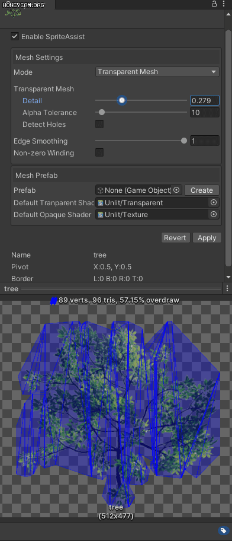
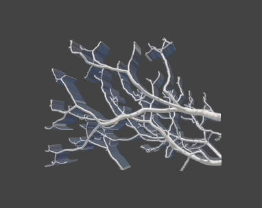

# Unity-SpriteAssist



<p>


</p>

<p>


</p>

## ℹ️About
Unity-SpriteAssist is an Unity extension that assist Sprite's mesh creation more conveniently.

## 🖥️System Requirements
Unity 2019.4 or later versions

## 📝Features
- **Dynamic preview**
- **Make a transparent, opaque, complex(transparent + opaque) mesh**
- **Convert Sprite to MeshRenderer Prefab**

## 📦Installation
### Unity Package Manager
You can add `https://github.com/sr4dev/Unity-SpriteAssist.git?path=Assets/SpriteAssist` to Package Manager.


### OpenUPM
https://openupm.com/packages/com.sr4dev.unity-spriteassist/
```
openupm add com.sr4dev.unity-spriteassist
```

### Manual installation
Clone or download this repository and copy `Assets/SpriteAssist` folder to your Unity project.


## ✏️How to use
- Select a Sprite asset in the Project window.
- Check the `Enable SpriteAssist` on the Inspector window.
- Adjust Mode and parameters.

### Mode

- **Transparent Mesh**: Default Mode. Allow alpha pixel.
- **Opaque Mesh**: Disallow alpha pixel. You can use the mesh for opaque shader.
- **Complex**: Separate area by alpha.
  - Alpha pixel is converted to Transparent Mesh area.
  - Non-alpha pixel is converted to Opaque Mesh area.
  - To Use Complex mode must be created Mesh Prefab.
  - Complex mode dose not override original Sprite mesh.
  
### Parameter

- **Detail**: Density and accuracy of the mesh to the Sprite outline.
- **Alpha Tolerance**: Threshold for transparency considered when generating the outline.
- **Detect Holes**: Detect holes from outline.
- **Edge Smoothing**: Smoothing sharp edges.
- **Non-zero Winding**: Use Non-zero winding rule. Default Winding rule is even-odd.

Even-odd(left), Non-zero(right)


 
Wikipedia: [Non-zero winding](https://en.wikipedia.org/wiki/Nonzero-rule)

### Mesh Prefab

- **Prefab**: Linked Prefab with Sprite.
- **Create/Remove**: Create or remove a Prefab.
- **Default Transparent Shader**
- **Default Opaque Shader**

## ⚠️Warning!

### userData
This extension uses AssetImporter.userData of Texture asset. If your project already uses userData, it will be overridden.

Unity Document: [AssetImporter.userData](https://docs.unity3d.com/ScriptReference/AssetImporter-userData.html)

## ⚡Known Issues
In Unity 2022.2.x when using the **Sprite Atlas V2 - Enabled**, the following issues may occur:

- Preview is not displayed correctly.
- Mesh Prefab is not generated.
- sprites are displayed upside-down.
It is expected that resolving this issue may take some time, so it is recommended to use **Sprite Atlas V2 - Enabled For Builds** or **Sprite Atlas V1** for stable usage.

Unity Document: [Sprite Atlas v2](https://docs.unity3d.com/2022.2/Documentation/Manual/SpriteAtlasV2.html)

## 🗺️Roadmap
- Support pre-packed Sprite.
- Support Sprite Mode: Multiple.
- Add Sprite Animation example.
- Add tutorial(pdf, movies...).
- Release to the Asset Store.

## 🔣License
MIT License

## 📚Library
* Triangulation: [LibTessDotNet v1.1.13](https://github.com/speps/LibTessDotNet)
* Polygon Clipping: [Clipper v6.4.2](http://www.angusj.com/delphi/clipper.php)

## ☕Donation
<a href='https://ko-fi.com/sr4dev' target='_blank'>
