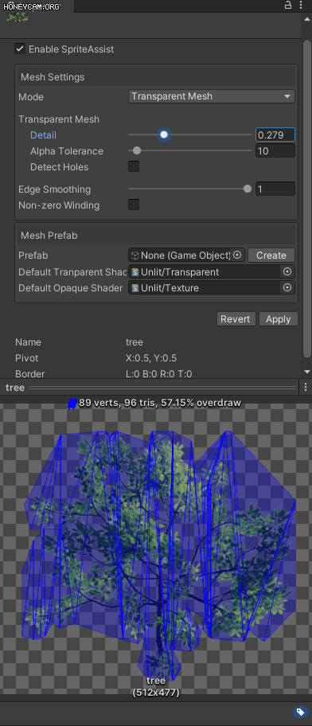
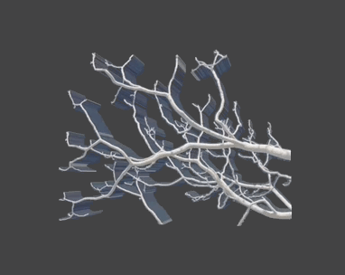

# Unity-SpriteAssist

[](https://openupm.com/packages/com.sr4dev.unity-spriteassist/)

## ℹ️About
Unity-SpriteAssist is an Unity extension that assist Sprite's mesh creation more conveniently.

## 🖥️System Requirements
Unity 2021.3 LTS or later versions

## 📝Features
- Control Vertex Easily with a Sliderbar.
- Make a transparent, opaque, complex(transparent + opaque) mesh
- Convert Sprite to MeshRenderer Prefab

## 📷Screenshots
<p>


</p>




## 📦Installation
### Unity Package Manager
You can add `https://github.com/sr4dev/Unity-SpriteAssist.git?path=Assets/SpriteAssist` to Package Manager.


### OpenUPM
https://openupm.com/packages/com.sr4dev.unity-spriteassist/
```
openupm add com.sr4dev.unity-spriteassist
```

### Manual installation
Clone or download this repository and copy `Assets/SpriteAssist` folder to your Unity project.


## ✏️How to use
- Select a Sprite asset in the Project window.
- Select a Mode and adjust parameters.

### Mode

- **Transparent Mesh**: Default Mode. Allow alpha pixel.
- **Opaque Mesh**: Disallow alpha pixel. You can use the mesh for opaque shader.
- **Complex**: Separate area by alpha.
  - Alpha pixel is converted to Transparent Mesh area.
  - Non-alpha pixel is converted to Opaque Mesh area.
  - To Use Complex mode must be created Mesh Prefab.
  - Complex mode dose not override original Sprite mesh.
  
### Parameter

- **Detail**: Density and accuracy of the mesh to the Sprite outline.
- **Alpha Tolerance**: Threshold for transparency considered when generating the outline.
- **Detect Holes**: Detect holes from outline.
- **Edge Smoothing**: Smoothing sharp edges.
- **Non-zero Winding**: Use Non-zero winding rule. Default Winding rule is even-odd.

Even-odd(left), Non-zero(right)


 
Wikipedia: [Non-zero winding](https://en.wikipedia.org/wiki/Nonzero-rule)

### Mesh Prefab

- **Prefab**: Linked Prefab with Sprite.
- **Create/Remove**: Create or remove a Prefab.
- **Default Transparent Shader**
- **Default Opaque Shader**

### Triangulation Library
Since v1.3.0, SpriteAssist supports `iShapeTriangulation` as an alternative triangulation library. You can select the default library in Project Settings.

`LibTessDotNet` is the stable and lightweight default option. `iShapeTriangulation` can generate meshes with the same vertex count but fewer thin, elongated triangles, though it is heavier and may fall back to `LibTessDotNet` automatically when triangulation fails.

<p>

</p>

**LibTessDotNet**


**iShapeTriangulation**


## ⚠️Caution!

### AssetImporter.userData
This extension uses AssetImporter.userData of Texture asset. If your project already uses userData, it will be overridden.

Unity Document: [AssetImporter.userData](https://docs.unity3d.com/ScriptReference/AssetImporter-userData.html)

### Known Issues
- Does not support SpriteAtlas.
- Does not support PSD file.

For other issues, please refer to the link.
https://github.com/sr4dev/Unity-SpriteAssist/issues

## 🗺️Roadmap
- Support pre-packed Sprite.
- Support Sprite Mode: Multiple.
- Add Sprite Animation example.
- Add tutorial(pdf, movies...).
- Release to the Asset Store.

## 🔣License
MIT License

## 📚Library
* Triangulation: [LibTessDotNet v1.1.13](https://github.com/speps/LibTessDotNet), [iShapeTriangulation v0.0.8](https://github.com/iShapeUnity/Triangulation)
* Polygon Clipping: [Clipper v6.4.2](http://www.angusj.com/delphi/clipper.php)

## ☕Donation
[ko-fi.com/sr4dev](https://ko-fi.com/sr4dev)
